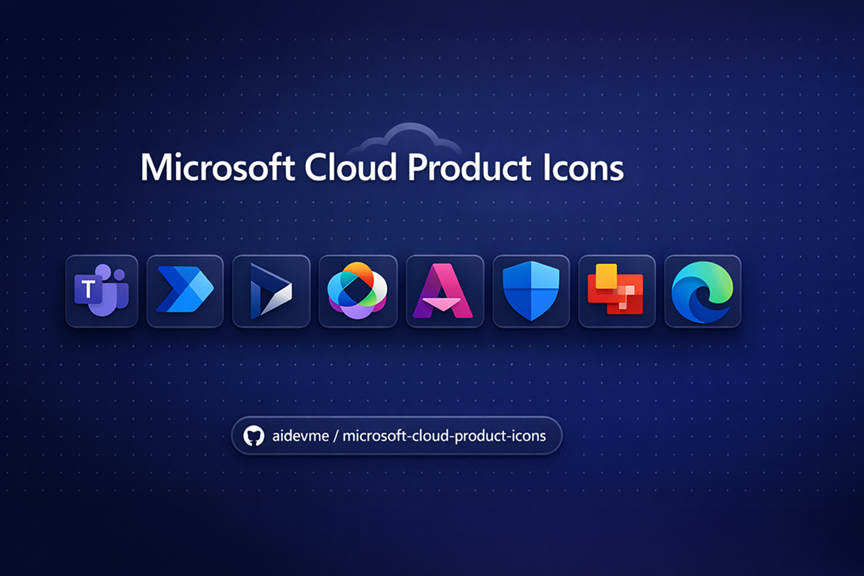

# Microsoft Cloud Product Icons

A curated collection of official Microsoft Cloud product icons in SVG and PNG format, organized by category and ready to use in your projects, presentations, and documentation.

---

## Table of Contents

- [Copilot](#copilot)
- [Dynamics 365](#dynamics-365)
- [Entra](#entra)
- [Fabric](#fabric)
- [Microsoft 365](#microsoft-365)
- [Other](#other)
- [Power Platform](#power-platform)
- [Security](#security)
- [Viva](#viva)
- [License](#license)

---

## Copilot

Icons for Microsoft Copilot products.

📁 [`assets/Copilot/`](assets/Copilot/) · 📄 [View all icons](documentation/copilot.md)

---

## Dynamics 365

Icons for Microsoft Dynamics 365 business applications.

📁 [`assets/Dynamics 365/`](assets/Dynamics%20365/) · 📄 [View all icons](documentation/dynamics-365.md)

---

## Entra

Icons for Microsoft Entra identity and access products.

📁 [`assets/Entra/`](assets/Entra/) · 📄 [View all icons](documentation/entra.md)

---

## Fabric

Icons for Microsoft Fabric data and analytics platform.

📁 [`assets/Fabric/`](assets/Fabric/) · 📄 [View all icons](documentation/fabric.md)

---

## Microsoft 365

Icons for Microsoft 365 productivity apps and services.

📁 [`assets/Microsoft 365/`](assets/Microsoft%20365/) · 📄 [View all icons](documentation/microsoft-365.md)

---

## Other

Icons for other Microsoft products and services.

📁 [`assets/Other/`](assets/Other/) · 📄 [View all icons](documentation/other.md)

---

## Power Platform

Icons for Microsoft Power Platform products.

📁 [`assets/Power Platfom/`](assets/Power%20Platfom/) · 📄 [View all icons](documentation/power-platform.md)

---

## Security

Icons for Microsoft Security products.

📁 [`assets/Security/`](assets/Security/) · 📄 [View all icons](documentation/security.md)

---

## Viva

Icons for Microsoft Viva employee experience products.

📁 [`assets/Viva/`](assets/Viva/) · 📄 [View all icons](documentation/viva.md)

---

## License

This repository is licensed under [CC BY 4.0](LICENSE).

All icons and logos are the property of Microsoft Corporation. See the [LICENSE](LICENSE) file for full details and the Microsoft trademark disclaimer.
